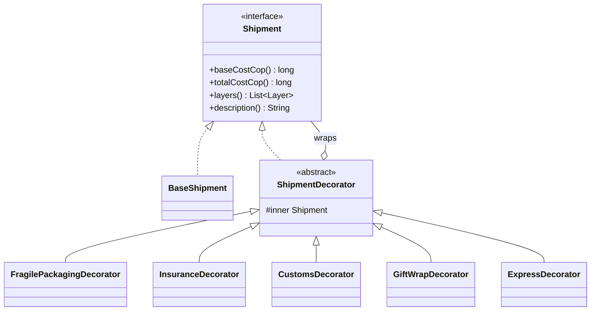

# Barniz Express

Shipping quote service for handcrafted **Barniz de Pasto** pieces (mopa-mopa lacquer, Pasto, Colombia).
University project for the Software Patterns course, built around the **Decorator** pattern.

**Authors:** Nicolas Casanova (backend), Samuel Vallejo (frontend).

## The idea

A piece is shipped as a base `Shipment`. Every shipping option WRAPS the shipment in one more layer, the way a
Russian doll or a gift box does. Each layer adds its own cost, description and notes. The pattern lets us combine
any options in any subset without inheritance and without a giant `if` block.



## Decorators created

Wrapping order, innermost to outermost: `BaseShipment -> FRAGILE -> INSURANCE -> CUSTOMS -> GIFT -> EXPRESS`.

| Decorator | Adds | Rule |
|---|---|---|
| `FragilePackagingDecorator` | foam lining, double-wall box | +18,000 COP |
| `InsuranceDecorator` | coverage of the declared value | 2% of declared value, min 5,000 COP |
| `CustomsDecorator` | DIAN export declaration, commercial invoice | +60,000 COP, international only |
| `GiftWrapDecorator` | wrapping and a card | +9,000 COP, message required, max 140 chars |
| `ExpressDecorator` | 1-2 business days | +35% of everything inside it |

`ExpressDecorator` is deliberately order-dependent: it charges 35% of the accumulated total of the layers under it,
which shows why the wrapping order matters in this pattern. `CUSTOMS` and `EXPRESS` are incompatible.

Custom annotation decorators (Spring AOP and Bean Validation): `@AuditedQuote`, `@ValidGiftMessage`, `@SafeText`.

Base cost: `12,000 + 6,000 * weightKg`, plus `45,000` for international destinations.

## API

Full contract in [`docs/superpowers/specs/2026-10-02-barniz-express-backend-design.md`](docs/superpowers/specs/2026-10-02-barniz-express-backend-design.md).
Routes: `POST /api/v1/auth/login`, `GET /api/v1/products`, `GET /api/v1/options`, `POST /api/v1/quotes`.
Tokens expire after 24 hours.

## Run

Requires Java 21 and Maven.

```bash
mvn test
mvn spring-boot:run   # http://localhost:8080
```

## Status

- [x] Domain layer: shipment core and the five decorators, with unit tests
- [x] Application service, REST controllers, JWT login, CORS
- [x] Custom annotations (`@AuditedQuote`, `@ValidGiftMessage`, `@SafeText`)
- [ ] Frontend (Vite + React + three.js)
